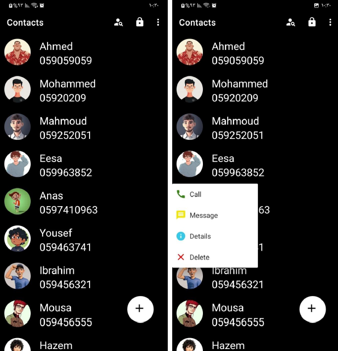

# 📇 Contacts App
[](LICENSE) <br>

**Contacts App** is an Android application designed to help users manage their personal contacts efficiently. This app enables users to store, update, and delete contact information including names, phone numbers, and emails using a smooth and intuitive interface.
This project came as part of explaining the topic of local databases SQLITE during my teaching work at the university in 2022. :) 

---

## 📱 Overview
This project offers a simple, user-friendly contact management system built using **Java** in **Android Studio**. It includes features such as adding new contacts, updating or removing existing ones, searching through stored contacts, and saving data locally using SQLite. The goal of this app is to provide a practical and lightweight solution for storing and managing personal contact information.

---

## ✨ Features
- 📤 **Add New Contact** – Easily add names, phone numbers, and email addresses.
- ✏️ **Edit Contact** – Update existing contact information.
- ❌ **Delete Contact** – Remove contacts you no longer need.
- 🔍 **Search Functionality** – Quickly find contacts by name.
- 🗃️ **Local Storage** – All contact data is saved securely on the device using SQLite.
- 🧭 **User-Friendly UI** – Simple and intuitive interface for all users.

---

## 🔧 Used Technologies
- ☎️ **Intent**
- 📑 **Fragments**
- 💾 **SQLite Database**
- 🔄 **Recycler View**
- 📱 **Alert Dialog**
- 🧠 **Shared Preferences**
- 🧩 **Menus**
- 🎛️ **Popup Menus**
- 🔁 **Swipe Refresh**
- 🔔 **Broadcast Receiver**
- ⚙️ **Services**

---

## 🚀 Installation
1. Clone the repository:
   ```bash
   git clone https://github.com/FaresSaleemGHub/Contacts-App.git
2. Open the project in Android Studio and click Open an existing project.
3. Build and run the app either on an emulator or a connected Android device.

---

## 🛠️ Built With
- **Java** – for backend logic
- **XML** – for Android UI layouts
- **Android Studio** – development environment
- **Gradle** – build system

  ---

##  🖼️ App Demo


---
## 👤 Author
Written with passion by – @FaresSaleemGHub

---

## 📜 License
This project is open-source and available under the MIT License.
